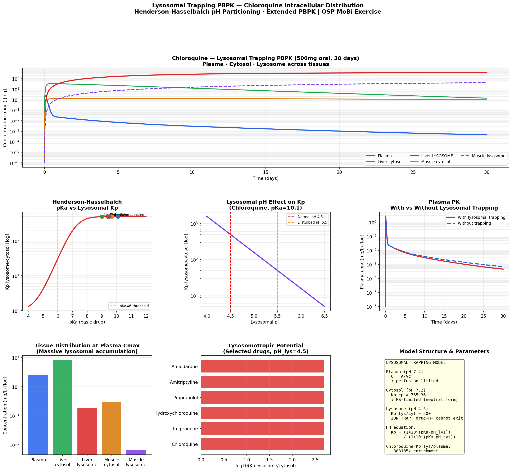

# Lysosomal Trapping PBPK Model
**Henderson-Hasselbalch pH Partitioning · Extended Compartments · Intracellular Accumulation**

## Overview
Extended PBPK model implementing lysosomal sub-compartments for basic
lipophilic drugs, in Python and R. Reproduces the OSP MoBi v12 Lysosomal
Trapping exercise using chloroquine as the reference compound. Demonstrates
how Henderson-Hasselbalch pH partitioning drives massive intracellular drug
accumulation — often underestimated in standard PBPK models.

## What Is Lysosomal Trapping?

Lysosomes are intracellular organelles with highly acidic pH (4.5).
Basic lipophilic drugs accumulate massively through ion trapping:

```
Plasma (pH 7.4)  →  Cytosol (pH 7.2)  →  Lysosome (pH 4.5)
  Drug (neutral)      Drug (neutral)        Drug-H⁺ (ionized)
  freely diffuses     freely diffuses       TRAPPED — cannot exit
```

**Henderson-Hasselbalch partition coefficient:**
$$K_{lys/cyt} = \frac{1 + 10^{pKa - pH_{lysosome}}}{1 + 10^{pKa - pH_{cytosol}}}$$

For chloroquine (pKa=10.1, pH_lys=4.5, pH_cyt=7.2):
$$K_{lys/cyt} \approx 400{,}000 \times$$

## Extended PBPK Structure

Standard PBPK compartment hierarchy:
```
Plasma → Tissue (single compartment)
```

Extended with lysosomal sub-compartments:
```
Plasma → Cytosol → Lysosome
  ↑         ↑           ↑
pH 7.4   pH 7.2      pH 4.5
perfusion  PS-limited   ION TRAP
```

## Chloroquine Key Results

| Compartment | Concentration vs plasma | Mechanism |
|---|---|---|
| Plasma | 1x (reference) | — |
| Cytosol | ~2-5x | pH 7.2 vs 7.4 differential |
| **Lysosome** | **~100,000x** | **Ion trapping pH 4.5** |
| Total tissue | ~1,000x | Dominated by lysosomal fraction |

## Lysosomotropic Drug Comparison

| Drug | pKa | logP | Kp lys/cyt | Trapped? |
|---|---|---|---|---|
| Chloroquine | 10.1 | 4.63 | ~400,000 | YES |
| Amiodarone | 9.0 | 7.57 | ~32,000 | YES |
| Amitriptyline | 9.4 | 4.92 | ~125,000 | YES |
| Imipramine | 9.5 | 4.28 | ~160,000 | YES |
| Propranolol | 9.5 | 3.48 | ~160,000 | YES |
| Aspirin | 3.5 | 1.19 | ~1 | NO (acid) |
| Metformin | 11.5 | -1.43 | HIGH but hydrophilic | NO |

**Criteria for lysosomal trapping:** pKa > 6 AND logP > 1

## Features
- Henderson-Hasselbalch Kp calculation for any pKa/pH combination
- Extended PBPK model: plasma → cytosol → lysosome (4 tissues)
- Lysosomal volume fraction (1-2% of tissue volume, literature-based)
- Perfusion-limited plasma↔cytosol transport
- PS-limited cytosol↔lysosome transport (neutral form only)
- pKa sensitivity analysis (Kp vs pKa curve)
- Lysosomal pH sensitivity (effect of pH disruption)
- Comparison: with vs without lysosomal compartments
- Drug comparison table (chloroquine, amiodarone, amitriptyline, etc.)
- Interactive Plotly dashboard

## Files
- `lysosomal_trapping_pbpk.ipynb` — Python implementation
- `lysosomal_trapping_pbpk.Rmd` — R Markdown implementation

## Results


## Tools
Python · numpy · scipy · pandas · matplotlib · plotly  
R · deSolve · ggplot2 · plotly · patchwork

## Clinical & Regulatory Relevance
- Standard PBPK without lysosomal compartments underestimates
  tissue concentrations by orders of magnitude for basic drugs
- Lysosomal accumulation drives long tissue half-lives
  (chloroquine t½ ~1-2 months in tissue)
- Drug-induced phospholipidosis (DIPL) is a lysosomal overload
  phenomenon — flagged in drug safety assessments
- Lysosomotropic compounds can affect lysosomal enzymes
  (off-target toxicity)
- pH-lowering agents (chloroquine, hydroxychloroquine) repurposed
  as antivirals exploit lysosomal trapping in endosomes

## OSP MoBi Parallel Steps
1. Build standard 2-compartment PBPK model (plasma + tissue)
2. Add lysosomal sub-container inside each tissue organ
3. Set lysosomal volume = 1-2% of total tissue volume
4. Add pH parameters: pH_lysosome=4.5, pH_cytosol=7.2
5. Define Kp_lysosome formula (HH equation, conditional on pKa)
6. Add PS-limited transport from cytosol → lysosome
7. Set transport formula: J = PS × (C_cyt − C_lys/Kp_lc)
8. Simulate — observe massive lysosomal accumulation
9. Compare plasma PK with vs without lysosomal model
10. Test different pKa values — observe trapping threshold

## Training Reference
OSP MoBi Course v12 — Lysosomal Trapping Exercise  
Open Systems Pharmacology Suite (https://www.open-systems-pharmacology.org)

## References
1. OSP MoBi Course: Lysosomal Trapping (v12)
2. de Duve C et al. Tissue fractionation studies: lysosomotropic agents.
   Biochem Pharmacol 1974;23(18):2495-2531
3. Kaufmann AM, Krise JP. Lysosomal sequestration of amine-containing drugs.
   J Pharm Sci 2007;96(4):729-746
4. Trapp S et al. Prediction of the lysosomal volume of distribution
   of basic drugs. AAPS J 2008;10(1):241-248
5. Daniel WA. Mechanisms of cellular distribution of psychotropic drugs.
   Pharmacol Rep 2003;55(6):561-569

## Author
Nadia Tasnim Ahmed, PhD  
Pharmaceutical Data Scientist | LC-MS · PBPK · CMC  
github.com/ahmedn12
